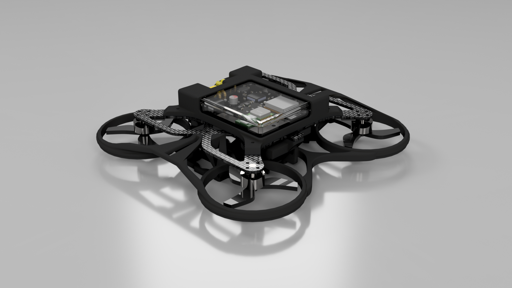

## Hello there
My name is Arkadiusz Rozmarynowicz, and I study Automatic Control and Robotics at Warsaw University of Technology, Poland.

 Along with my main field of study, I am very passionate about:

Electronics  
Computer Science  
Mechanics  
Space Exploration  
Physics  

<!-- 

and anything related to <b>physics</b>: science that has forever driven my curiosity about the Universe, and which I aim to progress through my engineering work.

 -->

And I aim to positively and meaningfully contribute to the development of engineering.

## LinkedIn 
You can also visit my [LinkedIn](https://www.linkedin.com/in/arkadiusz-rozmarynowicz-ar/) profile for details on my work experience and certificates.

## About my projects
Please take a look at my repositories to find many projects I've been working on for the past few years.
<!-- Each one of them has been driven by my:
- sheer passion for the subjects
- ever-growing love for learning
- lifetime ambition to contribute to the development of science and technology. -->

---

### Hobby projects:
- **["Overspelled" Video Game](https://github.com/A-Rozmarynowicz/Portfolio_Overspelled): one of my most demanding projects yet.**
- [Custom RC Transceiver](https://github.com/A-Rozmarynowicz/Custom_RC_Transceiver): a neat and polished project I developed back in high school, used for controlling RC vehicles.
- [RC Off-Road Car](https://github.com/A-Rozmarynowicz/RC_Off-Road_Car): a reworked RC toy with custom electronics, body, and repaired mechanical systems.
- [Prisoner's Dilemma Simulator](https://github.com/A-Rozmarynowicz/Prisoners_Dilemma_Simulator): a little and fun hobby project that has recently sparked my interest in Game Theory simulations.
- [Minor Hobby Projects](https://github.com/A-Rozmarynowicz/Minor_Hobby_Projects_Portfolio): a set of some of my smaller projects that showcase my lifetime passion for creation.
- [RC Drift Car](https://github.com/A-Rozmarynowicz/RC_Drift_Car): a LEGO car enhanced by custom electronics.

---

### Favorite University projects:
- **[Full Implementation of a Quadcopter](https://github.com/A-Rozmarynowicz/Quadcopter_Full_Implementation): robust from-scratch design and implementation of hardware, software, and simulation for a drone.**
- [Ultra-Wideband Positioning System](https://github.com/A-Rozmarynowicz/UWB_Positioning_System): universal, reliable, indoor locating modules that don't rely on a GPS signal.
- [Two Switch Flyback Converter](https://github.com/A-Rozmarynowicz/Two_Switch_Flyback_Converter):
a DC-DC power converter. Performed detailed calculations, designed a PCB, simulated, and tested the circuit.
- [Inverted Pendulum Control with Reinforcement Learning](https://github.com/A-Rozmarynowicz/Inverted_Pendulum_Reinforcement_Learning): a framework for Gymnasium environments, showcased with Q-Learning and SARSA algorithms.
- [Macau](https://github.com/A-Rozmarynowicz/Macau): my first-ever Python project: a card game with functional GUI and bot players.
- [FPGA Communication System](https://github.com/A-Rozmarynowicz/FPGA_Communication_System): a flexible and reliable UART-parallel converter, simulated, implemented, and tested in the Vivado software.

## What I'm working on now:
- Full quadcopter implementation for my Bachelor's project
- Development of "Overspelled"
- Working on buses and cars in a workshop

  I am currently focused on 3D designing and assembling my quadcopter, hence my limited GitHub activity over the past months:

  
<em>Figure 3: 3D model of the quadcopter.</em>
 

<!-- - Hobby physics simulations -->

<!--
## Favorite books:
- "The Feynman Lectures on Physics" by Richard Feynman, Matthew Sands, and Robert B. Leighton.
- "Can't Hurt Me" by David Goggins.
-->

<!--
**A-Rozmarynowicz/A-Rozmarynowicz** is a ✨ _special_ ✨ repository because its `README.md` (this file) appears on your GitHub profile.

Here are some ideas to get you started:

- 🔭 I’m currently working on ...
- 🌱 I’m currently learning ...
- 👯 I’m looking to collaborate on ...
- 🤔 I’m looking for help with ...
- 💬 Ask me about ...
- 📫 How to reach me: ...
- 😄 Pronouns: ...
- ⚡ Fun fact: ...
-->
